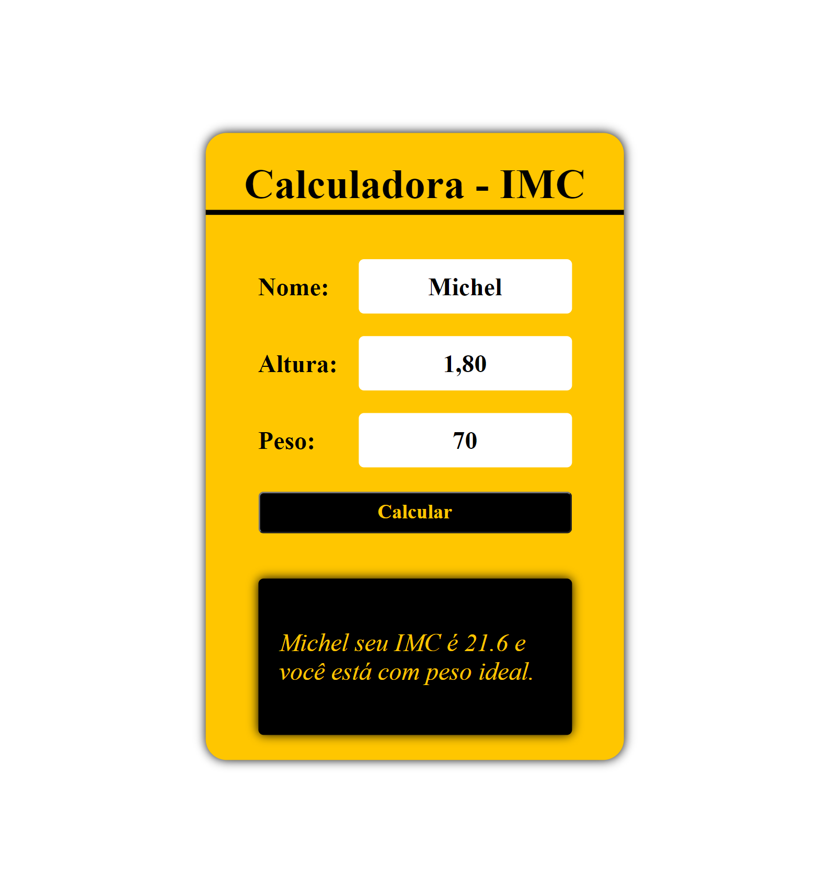

# Projeto Calculadora IMC

 Desenvolvido para aprendizado durante a aula de Javascript. 30/09/22

[ 🔗 Clique aqui para acessar] (https://michel-maia.github.io/Projeto-Calculadora-IMC/)

## 💻 Tecnologias
- HTML
- CSS
- JavaScript

## Referência
canal Youtube do Fernando Leonid 

- [Youtube] https://www.youtube.com/c/FernandoLeonid
